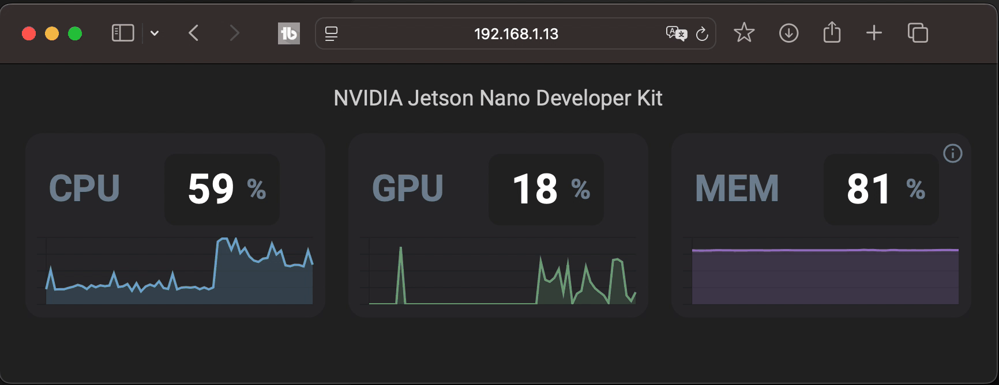

# system-monitor
A web enabled system monitor for NVIDIA Jetson Development Kits


## Work in progress

Building Documentation and Video, full article on JetsonHacks.com soon!

Requires Python 3.10+ - For Jetson Nano & Xaviers, consider using a virtual environment (e.g. Anaconda)

An example of creating a webserver to deliver a subset of system data such as CPU, GPU and memory usage. Please note that this is example code, and the webserver is not meant to be exposed to the Internet at large without adding in proper authentication and other security. For use on local private networks.

Websockets allow refreshing the data easily.

The Tutorial folder holds some resources which explain how the server is built incrementally. The supporting documentation will be available when the tutorial and video become available.

## Requirements
For this project, we're using Python based FastHTML for the web server.
* [FastHTML web page](https://fastht.ml)
* [FastHTML on Github](https://github.com/AnswerDotAI/fasthtml)

FastHTML has built in support for websockets. However for this project we're using a different websocket library. This is for learning purposes, not quite so automagic.

Chart.js is used for the time series charts on the web client. [Chart.js on Github](https://github.com/chartjs/Chart.js)

You will need to install the requirements:
```
pip install -r requirements.txt
```

To enable WebSockets when connecting from another machine, you need to set the server address in the server_config.ini file. The IP address should be the IP address of the server (this) machine.

## Notes
* **October, 2024**
* Initial Release
* Tested on Jetson Nano, Jetson Xavier, and Jetson Orin
* Requires Python 3.10+
* FastHML 0.6.13
* psutil 6.1.0
